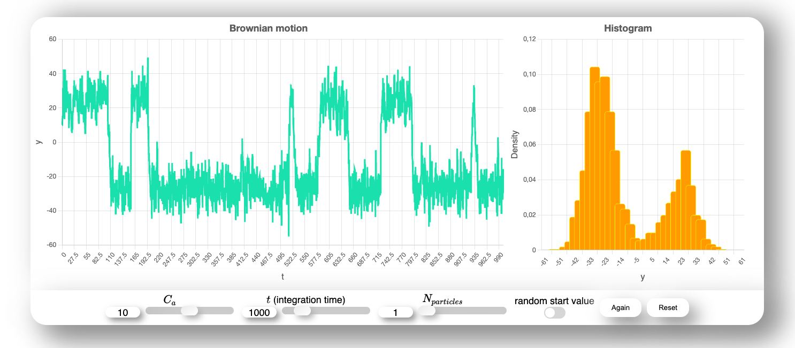
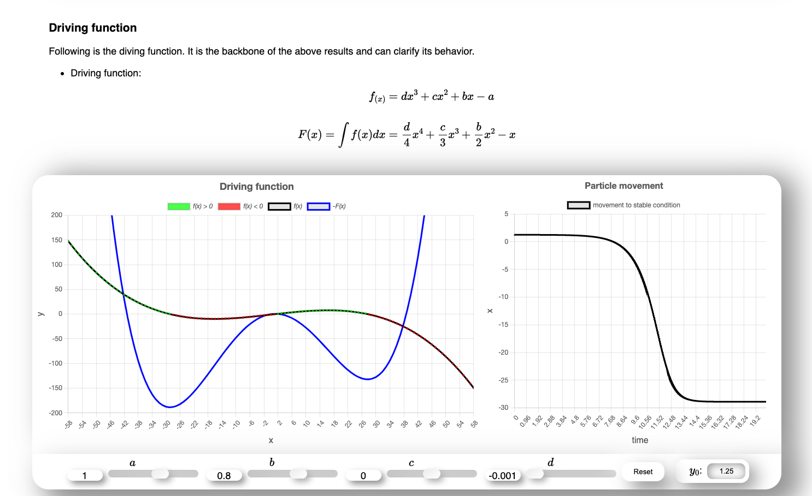

# [Brownian Motion with multiple particles - Website](https://btschwertfeger.github.io/Brownian-Motion-Multiple-Particle-Website)

This website serves as teaching material for the support and understanding of
the Brownian Motion and the driving function by visualizing results which can be
manipulated.

## Availability:

- [https://btschwertfeger.github.io/Brownian-Motion-Multiple-Particle-Website](https://btschwertfeger.github.io/Brownian-Motion-Multiple-Particle-Website)
- [https://www.awi.de/ ....](https://www.awi.de/fileadmin/user_upload/AWI/Forschung/Klimawissenschaft/Dynamik_des_Palaeoklimas/BrownianMotion/index.html)
